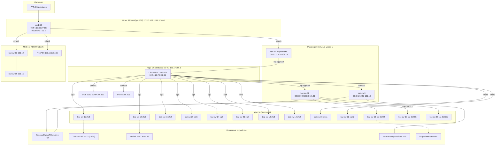

# Карта сети BSZ (Mermaid) — 2026-09-12

> Актуальная физическая топология после полного рескана.
> Источник: LLDP CRS328/RB5009 + FDB всех коммутаторов + OUI.

## Схема

## Портовая карта CRS328 (ядро)

| Порт | Сосед |
|------|-------|
| sfp-sfpplus1 | bsz-sw-02 (DGS-3000) |
| sfp-sfpplus4 | bsz-sw-05 + gw.BSZ |
| combo3 | bsz-sw-9 |
| combo1 | DGS-1210-10MP |
| combo4 | D-Link (106.203) |
| sfp2-12 | bsz-sw-11/12/15/20/24/21/19/14/16/22 |

## Карта Zabbix

Карта «BSZ - Топология» (id=8) в Zabbix — 57 хостов на прокси, элементы по LLDP.