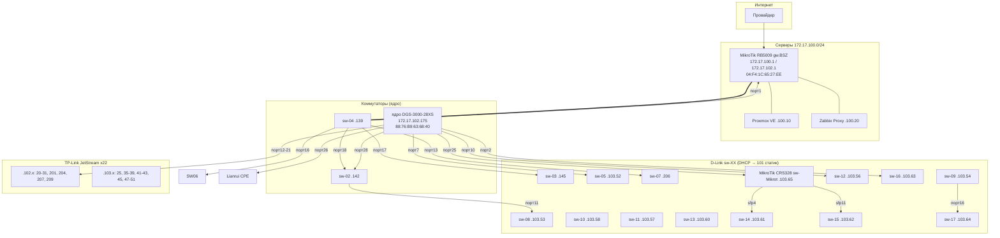

# Топология сети

> Дата обновления: 2026-09-07
> Источник: LLDP (SNMP lldpRemTable со всех коммутаторов), FDB (dot1qTpFdbTable), ARP

## Схема (Mermaid)



## Линки между коммутаторами (LLDP, подтверждено с двух сторон)

| Коммутатор | Порт | Сосед | Порт соседа |
|-----------|------|-------|-------------|
| gw.BSZ (RB5009) | ether6 | sw-04 | 1 |
| sw-04 | 13 | sw-07 | 1 |
| sw-04 | 16 | sw-06 | 15 |
| sw-04 | 17 | sw-03 | 20 |
| sw-04 | 18 | sw-02 | 1 |
| ядро DGS-3000 | 28 | sw-02 | 10 |
| ядро DGS-3000 | 7 | sw-05 | 9 |
| ядро DGS-3000 | 10 | sw-12 | 9 |
| ядро DGS-3000 | 2 | sw-16 | 9 |
| ядро DGS-3000 | 25 | sw-Mikrot (CRS328) | sfp-sfpplus1 |
| ядро DGS-3000 | 12-21 | TP-Link JetStream x10 | GE25/26 |
| ядро DGS-3000 | 26 | Lianrui CPE | — |
| sw-02 | 11 | sw-08 | 52 |
| sw-08 | 52 | sw-02 | 11 |
| CRS328 | sfp4 | sw-14 | 9 |
| CRS328 | sfp11 | sw-15 | 9 |
| sw-09 | 16 | sw-17 | 18 |

## Привязка устройств к коммутаторам (FDB, прямые подключения)

> Прямые подключения (не аплинк). Аплинк-порты видят все MAC (bridge-домен) — исключены.

### Ядро DGS-3000 (172.17.102.175)
| Порт | Устройства |
|------|-----------|
| 2 | cam-41.115, cam-41.150, PC-41.251 |
| 7 | PC-.187, prn-Can.42, prn-HP.41 |
| 8 | cam-41.111 (Hikvision) |
| 10 | prn-Brother.49 |
| 12 | HP-.180, PC-.219, cam-41.163, prn-HP.66 |
| 14 | PC-41.243 |
| 17 | cam-41.46, cam-41.49 |
| 19 | cam-41.148 |
| 20 | cam-41.88 |
| 21 | PC-41.133 |
| 25 | DP750-.16 |
| 26 | Lianrui CPE |

### sw-07 (172.17.102.206) — камерный блок
| Порт | Устройства |
|------|-----------|
| 2 | IPC-.63 (Dahua) |
| 3 | cam-41.158 |
| 4 | cam-40.155 |
| 5 | IPC-41.236 |
| 6 | cam-41.159 |

### sw-16 (172.17.103.63)
| Порт | Устройства |
|------|-----------|
| 3 | PC-41.251, cam-41.150 |
| 6 | cam-41.115 |

### sw-05 (172.17.103.52)
| Порт | Устройства |
|------|-----------|
| 1 | PC-.187, prn-HP.41 |
| 5 | prn-Can.42 |

### sw-09 (172.17.103.54)
| Порт | Устройства |
|------|-----------|
| 2 | prn-HP.66 |
| 7 | PC-.219 |
| 15 | HP-.180 |

### sw-17 (172.17.103.64)
| Порт | Устройства |
|------|-----------|
| 18 | HP-.180, PC-.219, prn-HP.66 |

## Актуальная топология (2026-09-08, ядро = CRS328)

```
gw.BSZ (RB5009, .1 в 100/101/102) — LLDP: порт 7 → bsz-sw-03
  │
CRS328 (bsz-sw-01, 172.17.101.10)  ← ЯДРО
  │п25 ── DGS-3000 (bsz-sw-02, 172.17.101.11)
  │п3 ── bsz-sw-11 (.20)     │п28 ── bsz-sw-04 (.13) ──п11── bsz-sw-09 (DHCP .102.102)
  │п4 ── bsz-sw-12 (.21)     │п7 ── bsz-sw-08 (.17)
  │п5 ── bsz-sw-15 (.24)     │п10 ── bsz-sw-13 (.22)
  │п6 ── bsz-sw-20 (.29)     │п2 ── bsz-sw-17 (.26)
  │п8 ── bsz-sw-21 (.30)     │п12-21 ── TP-Link JetStream ×10
  │п9 ── bsz-sw-19 (.28)
  │п12 ── bsz-sw-16 (.25)
  │п13 ── bsz-sw-22 (.31)
  │п2 ── EAP225-Outdoor, SIP-T30P (access)
```

### Камеры (FDB, было)
- ядро DGS-3000 (старое ядро, теперь bsz-sw-02): порты 2/8/12/17/19/20
- sw-07 (bsz-sw-05): порты 2-6
- После перекоммутации (ядро = CRS328) привязка камер может сместиться — обновить по FDB.

## Ключевые выводы


## Карта портов ядра CRS328 (bsz-sw-01, 172.17.106.5)

| Порт RouterOS | LLDP-порт | Сосед | FDB (MAC) |
|---|---|---|---|
| sfp2 | 3 | bsz-sw-11 | 2 |
| sfp3 | 4 | bsz-sw-12 | — |
| sfp4 | 5 | **bsz-sw-15** | **122 (агрегация)** |
| sfp5 | 6 | bsz-sw-20 | — |
| sfp6 | 7 | bsz-sw-24 | — |
| sfp7 | 8 | bsz-sw-21 | — |
| sfp8 | 9 | bsz-sw-19 | — |
| sfp9 | 10 | bsz-sw-14 | 3 |
| sfp11 | 12 | bsz-sw-16 | 10 |
| sfp12 | 13 | bsz-sw-22 | 6 |

> FDB CRS328: 181 MAC / 13 портов. Основная масса (122) за **bsz-sw-15** (sfp4) — агрегатор/uplink.

## FDB-дампы (reports/fdb/)
- `fdb_172_17_106_5.txt` — CRS328 (181 MAC)
- `fdb_172_17_107_53.txt` — bsz-sw-10 (208 MAC)
- `fdb_172_17_101_12.txt` — bsz-sw-03 (36 MAC)
- `fdb_172_17_101_15.txt` — bsz-sw-06 (33 MAC)
