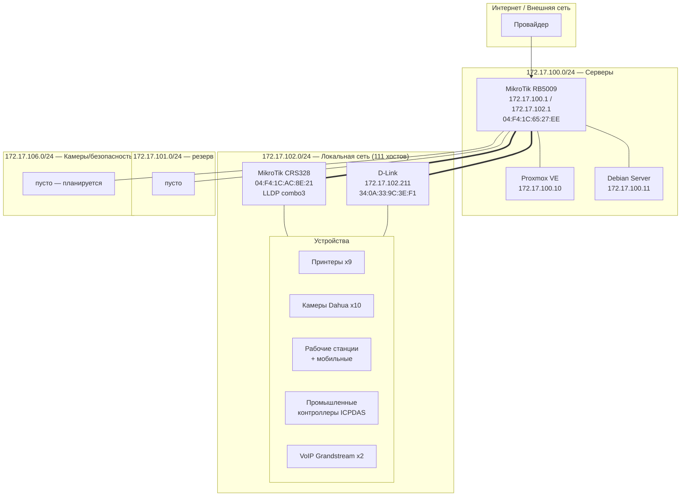

# Топология сети

> Дата обновления: 2026-09-02
> Источник: LLDP (lldpd), ARP, инвентаризация

## Схема (Mermaid)

## Сегменты

| Сегмент | Подсеть | Хостов | Роль |
|---------|---------|--------|------|
| Серверы | 172.17.100.0/24 | 3 | RB5009 (шлюз/DNS), Proxmox, Debian |
| Резерв | 172.17.101.0/24 | 0 | свободна |
| Локальная сеть | 172.17.102.0/24 | 111 | рабочие станции, принтеры, камеры, VoIP, промышленность |
| Безопасность | 172.17.106.0/24 | 0 | планируется под камеры/безопасность |

## LLDP-наблюдения (lldpd, 2026-09-02)

| Сосед | ChassisID | SysName/Descr | Порт | Примечание |
|-------|-----------|---------------|------|------------|
| MikroTik CRS328 | 04:F4:1C:AC:8E:21 | MikroTik RouterOS 7.19.5 CRS328-4C-20S-4S+ | combo3 (bridge/combo3) | MgmtIP 192.168.88.1 |
| D-Link | A0:A3:F0:D2:20:53 | — | — | отдаёт LLDP, TTL 3601 |
| — | 88:AE:DD:60:39:A3 | — | — | рабочая станция (EliteGroup) |
| — | 78:98:E8:C1:E8:61 | — | — | D-Link OUI |

## Физические связи (известные)

- **RB5009 (172.17.100.1) ↔ D-Link .211 (172.17.102.211)** — коммутация L2 (оба в enp5s0)
- **RB5009 ↔ MikroTik CRS328** — через LLDP-порт combo3
- Остальные связи (порт-в-порт) требуют полного доступа к коммутаторам (LLDP от D-Link закрыт)

## Неопределённости

1. Точная физическая топология коммутаторов (порт-в-порт) не установлена — LLDP от D-Link
   коммутаторов закрыт, требуется доступ.
2. Расположение D-Link коммутаторов в новых подсетях не до конца определено (найдены 2 по MAC).
3. 172.17.106.0/24 (камеры) ещё не задействована — камеры Dahua сейчас в 172.17.102.0/24.