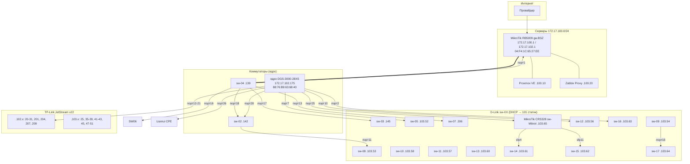

# Топология сети

> Дата обновления: 2026-09-07
> Источник: LLDP (SNMP lldpRemTable со всех коммутаторов), FDB (dot1qTpFdbTable), ARP

## Схема (Mermaid)

## Линки между коммутаторами (LLDP, подтверждено с двух сторон)

| Коммутатор | Порт | Сосед | Порт соседа |
|-----------|------|-------|-------------|
| gw.BSZ (RB5009) | ether6 | sw-04 | 1 |
| sw-04 | 13 | sw-07 | 1 |
| sw-04 | 16 | sw-06 | 15 |
| sw-04 | 17 | sw-03 | 20 |
| sw-04 | 18 | sw-02 | 1 |
| ядро DGS-3000 | 28 | sw-02 | 10 |
| ядро DGS-3000 | 7 | sw-05 | 9 |
| ядро DGS-3000 | 10 | sw-12 | 9 |
| ядро DGS-3000 | 2 | sw-16 | 9 |
| ядро DGS-3000 | 25 | sw-Mikrot (CRS328) | sfp-sfpplus1 |
| ядро DGS-3000 | 12-21 | TP-Link JetStream x10 | GE25/26 |
| ядро DGS-3000 | 26 | Lianrui CPE | — |
| sw-02 | 11 | sw-08 | 52 |
| sw-08 | 52 | sw-02 | 11 |
| CRS328 | sfp4 | sw-14 | 9 |
| CRS328 | sfp11 | sw-15 | 9 |
| sw-09 | 16 | sw-17 | 18 |

## Привязка устройств к коммутаторам (FDB, прямые подключения)

> Прямые подключения (не аплинк). Аплинк-порты видят все MAC (bridge-домен) — исключены.

### Ядро DGS-3000 (172.17.102.175)
| Порт | Устройства |
|------|-----------|
| 2 | cam-41.115, cam-41.150, PC-41.251 |
| 7 | PC-.187, prn-Can.42, prn-HP.41 |
| 8 | cam-41.111 (Hikvision) |
| 10 | prn-Brother.49 |
| 12 | HP-.180, PC-.219, cam-41.163, prn-HP.66 |
| 14 | PC-41.243 |
| 17 | cam-41.46, cam-41.49 |
| 19 | cam-41.148 |
| 20 | cam-41.88 |
| 21 | PC-41.133 |
| 25 | DP750-.16 |
| 26 | Lianrui CPE |

### sw-07 (172.17.102.206) — камерный блок
| Порт | Устройства |
|------|-----------|
| 2 | IPC-.63 (Dahua) |
| 3 | cam-41.158 |
| 4 | cam-40.155 |
| 5 | IPC-41.236 |
| 6 | cam-41.159 |

### sw-16 (172.17.103.63)
| Порт | Устройства |
|------|-----------|
| 3 | PC-41.251, cam-41.150 |
| 6 | cam-41.115 |

### sw-05 (172.17.103.52)
| Порт | Устройства |
|------|-----------|
| 1 | PC-.187, prn-HP.41 |
| 5 | prn-Can.42 |

### sw-09 (172.17.103.54)
| Порт | Устройства |
|------|-----------|
| 2 | prn-HP.66 |
| 7 | PC-.219 |
| 15 | HP-.180 |

### sw-17 (172.17.103.64)
| Порт | Устройства |
|------|-----------|
| 18 | HP-.180, PC-.219, prn-HP.66 |

## Ключевые выводы

1. **Камеры разнесены**: основная масса — на ядре DGS-3000 (порты 2/8/12/17/19/20),
   отдельный блок — на sw-07 (порты 2-6).
2. **sw-07** — фактически камерный коммутатор.
3. **sw-02** — узел с 3 аплинками (sw-04, ядро, sw-08) — STP включён, root = MikroTik.
4. **Кольцо/избыточность**: MikroTik → sw-04 → sw-02 → ядро DGS-3000 — защищено RSTP.