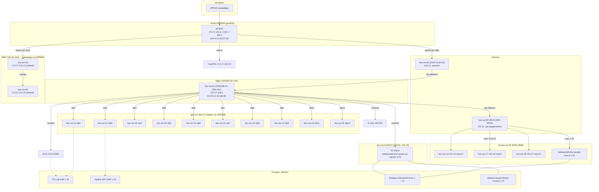

# Топология сети

> Дата обновления: **2026-09-12 (полный рескан)**
> Источник: **API RouterOS** (RB5009 ARP/FDB/LLDP, CRS328 FDB/LLDP), SNMP Q-BRIDGE FDB коммутаторов D-Link, OUI-идентификация
> ⚠️ Миграция: ядро — **CRS328 (bsz-sw-01, 172.17.106.5)**; инфраструктура/камеры → 172.17.106/107.x

## Схема (актуальная, Mermaid)

## Линки (подтверждено LLDP CRS328 + FDB, 2026-09-12)

### Аплинк ядра

| А | Порт | B | Метод |
|---|---|---|---|
| **RB5009** (gw.BSZ) | ether6 (br-106) | **bsz-sw-05** | LLDP RB5009 (/ip/neighbor ether6) |
| bsz-sw-05 (DGS-1210-20, 101.14) | — | **CRS328 sfp-sfpplus4** | LLDP CRS328 + FDB |
| **CRS328** | sfp-sfpplus1 | **bsz-sw-02 (DGS-3000-28XS)** | LLDP CRS328 + FDB |
| **CRS328** | combo3 | **bsz-sw-9 (DGS-1210-52)** | LLDP CRS328 |

### Прямые соседи CRS328 (LLDP, 2026-09-12)

| Порт CRS328 | Сосед | Модель | Примечание |
|---|---|---|---|
| sfp-sfpplus1 | bsz-sw-02 | DGS-3000-28XS | распределитель, 204 FDB |
| sfp-sfpplus4 | bsz-sw-05 + gw.BSZ | DGS-1210-20 | аплинк к шлюзу |
| combo3 | bsz-sw-9 | DGS-1210-52/ME/B1 | 52 порта, камеры |
| combo1 | DGS-1210-10MP (C8:78:7D:8B:49:B1) | | 106.192/107.189 |
| combo4 | D-Link (78:98:E8:C1:E8:61) | | 172.17.106.203 |
| sfp2 | bsz-sw-11 | DGS-1210-10 | |
| sfp3 | bsz-sw-12 | DGS-1210-10 | |
| sfp4 | bsz-sw-15 | DGS-1210-10 | |
| sfp5 | bsz-sw-20 | DGS-1210-10 | |
| sfp6 | bsz-sw-24 | DGS-1210-10 | |
| sfp7 | bsz-sw-21 | DGS-1210-10 | |
| sfp8 | bsz-sw-19 | DGS-1210-10 | |
| sfp9 | bsz-sw-14 | DGS-1210-10 | |
| sfp11 | bsz-sw-16 | DGS-1210-10 | |
| sfp12 | bsz-sw-22 | DGS-1210-10 | |
| sfp-sfpplus2 | неопознано (6C:B3:11:A1:A5:CE) | | 172.17.106.18 |
| combo2 | ASUS (04:42:1A:E9:C7:A5) | | 172.17.106.19 |

### За bsz-sw-02 (DGS-3000-28XS)

| Порт bsz-sw-02 | Подключено | IP |
|---|---|---|
| 2 | bsz-sw-17 | 101.26 |
| 10 | bsz-sw-13 | 101.22 |
| 12 | bsz-sw-18 | 101.27 |
| 25 | аплинк к CRS328 sfp-sfpplus1 | |
| 1,8,13-21 | камеры, метеостанции, ПК | ~50 устройств |

### MNG-коммутаторы на RB5009 ether5 (br-102)

| Порт RB5009 | Подключено | MAC |
|---|---|---|
| ether5 | bsz-sw-03 | 64:29:43:D5:C3:E0 (101.12) |
| ether5 | bsz-sw-06 | 78:98:E8:E4:C7:90 (101.15) |
| ether3 | FreePBX | BC:24:11:B0:6B:54 (102.15) |

## Адресация (актуальная, 2026-09-12)

| Устройство | IP | Bridge/подключение |
|---|---|---|
| gw.BSZ (RB5009) | 172.17.102.1 / 106.1 / 100.1 | br-106/102/100 |
| bsz-sw-01 (CRS328, ядро) | 172.17.106.5 | br-106 |
| bsz-sw-02 (DGS-3000-28XS) | 172.17.101.11 | за CRS328 sfp-sfpplus1 |
| bsz-sw-05 (транзит) | 172.17.101.14 | CRS328 sfp-sfpplus4 |
| bsz-sw-9 (DGS-1210-52) | 172.17.101.18 | CRS328 combo3 |
| bsz-sw-11 | 172.17.101.20 | CRS328 sfp2 |
| bsz-sw-12 | 172.17.101.21 | CRS328 sfp3 |
| bsz-sw-13 | 172.17.101.22 (+101.17) | bsz-sw-02 порт10 |
| bsz-sw-14 | 172.17.101.23 | CRS328 sfp9 |
| bsz-sw-15 | 172.17.101.24 | CRS328 sfp4 |
| bsz-sw-16 | 172.17.101.25 | CRS328 sfp11 |
| bsz-sw-17 | 172.17.101.26 | bsz-sw-02 порт2 |
| bsz-sw-18 | 172.17.101.27 | bsz-sw-02 порт12 |
| bsz-sw-19 | 172.17.101.28 | CRS328 sfp8 |
| bsz-sw-20 | 172.17.101.29 | CRS328 sfp5 |
| bsz-sw-21 | 172.17.101.30 | CRS328 sfp7 |
| bsz-sw-22 | 172.17.101.31 | CRS328 sfp12 |
| bsz-sw-24 | 172.17.101.33 | CRS328 sfp6 |
| bsz-sw-03 | 172.17.101.12 | RB5009 ether5 |
| bsz-sw-06 | 172.17.101.15 | RB5009 ether5 |
| bsz-sw-10 | **172.17.106.215** (не 107.53!) | вне прямого домена CRS328 |
| DGS-1210-10MP | 172.17.106.192 / 107.189 | CRS328 combo1 |

## FDB-сводка (2026-09-12)

| Коммутатор | FDB записей | uplink порт | Примечание |
|---|---|---|---|
| CRS328 (ядро) | 226 | — | sfp-sfpplus1=93 (bsz-sw-02), combo3=36 (bsz-sw-9) |
| bsz-sw-02 (DGS-3000) | 204 | 25 | 102 MAC за портом 25 |
| bsz-sw-05 | 203 | 17 | |
| bsz-sw-9 (52 порта) | 190 | 48 | 156 MAC за портом 48 |
| bsz-sw-11/12/15/16/19/20/21/22/24 | 176-195 | 9/10 | uplink к CRS328 |
| bsz-sw-18 | 197 | 20 | |
| bsz-sw-17 | 102 | 9 | |

## Ключевые выводы (2026-09-12)

1. **Ядро — CRS328 (106.5)**. Аплинк к шлюзу: RB5009 ether6 → **bsz-sw-05** → CRS328 **sfp-sfpplus4**.
2. **bsz-sw-02 (DGS-3000-28XS)** подключен к CRS328 **sfp-sfpplus1** и является распределителем:
   за ним bsz-sw-13/17/18 + ~50 камер/метеостанций/ПК.
3. **bsz-sw-9 (DGS-1210-52)** на CRS328 **combo3** — второй большой коммутатор (камеры, метеостанции).
4. **10 коммутаторов DGS-1210-10** (11/12/15/16/19/20/21/22/24) подключены **напрямую к CRS328** по SFP (sfp2-12).
5. **Кластер MNG** (bsz-sw-03/06) подключён к **RB5009 ether5 (br-102)**, FreePBX — ether3.
6. **bsz-sw-10** фактически на **106.215** (не 107.53); 107.53 занят Xiaomi-устройством.
7. **74 камеры** (Hikvision 51 + Dahua 23), в основном за bsz-sw-02 и bsz-sw-9.
8. **33-34 EAP** (TP-Link), телефоны Yealink, метеостанции — в сегменте 106/107.

## Открытые вопросы
- combo4 CRS328 (78:98:E8:C1:E8:61, 106.203) — D-Link, какой именно коммутатор?
- sfp-sfpplus2 (6C:B3:11, 106.18) — Lianrui-устройство, назначение неясно.
- combo2 (ASUS 04:42:1A, 106.19) — ПК или сервер?
- Полная привязка камер к портам — по FDB bsz-sw-02/bsz-sw-9 (data/fdb_all_2026-09-12.json).
- SNMP-доступ bsz-sw-03/06/10 не подтверждён (community отличается).