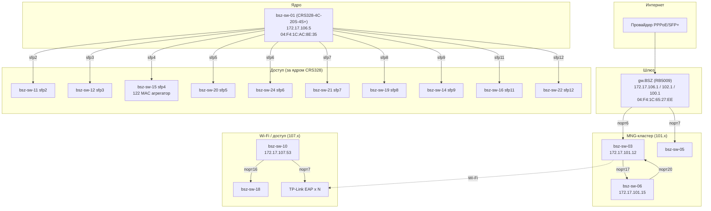

# Топология сети

> Дата обновления: 2026-09-09 (актуальная)
> Источник: LLDP (SNMP lldpRemTable), FDB (dot1qTpFdbTable), ARP (RB5009/CRS328)
> ⚠️ Произошла миграция: ядро — **CRS328 (bsz-sw-01, 172.17.106.5)**, камеры/инфраструктура → 172.17.106/107.x

## Схема (актуальная)

## Линки (LLDP, подтверждено)

| Устройство | Порт | Сосед |
|---|---|---|
| **gw.BSZ (RB5009)** | 6 | bsz-sw-03 |
| gw.BSZ | 7 | bsz-sw-05 |
| **bsz-sw-01 (CRS328, ядро)** | sfp2 | bsz-sw-11 |
| bsz-sw-01 | sfp3 | bsz-sw-12 |
| bsz-sw-01 | sfp4 | **bsz-sw-15** (агрегатор, 122 MAC) |
| bsz-sw-01 | sfp5 | bsz-sw-20 |
| bsz-sw-01 | sfp6 | bsz-sw-24 |
| bsz-sw-01 | sfp7 | bsz-sw-21 |
| bsz-sw-01 | sfp8 | bsz-sw-19 |
| bsz-sw-01 | sfp9 | bsz-sw-14 |
| bsz-sw-01 | sfp11 | bsz-sw-16 |
| bsz-sw-01 | sfp12 | bsz-sw-22 |
| **bsz-sw-03** (101.12) | 1 | gw.BSZ |
| bsz-sw-03 | 17 | bsz-sw-06 |
| bsz-sw-03 | 2, 13 | EAP225-Outdoor |
| **bsz-sw-06** (101.15) | 20 | bsz-sw-03 |
| bsz-sw-06 | 4 | EAP225-Outdoor, EAP223, W70B |
| **bsz-sw-10** (107.53) | 16 | bsz-sw-18 |
| bsz-sw-10 | 7 | EAP245 |

## Адресация (актуальная)

| Устройство | IP | Bridge RB5009 |
|---|---|---|
| gw.BSZ | 172.17.106.1 / 102.1 / 100.1 | br-106/102/100 |
| bsz-sw-01 (CRS328, ядро) | 172.17.106.5 | br-106 |
| bsz-sw-03 | 172.17.101.12 | br-102 |
| bsz-sw-06 | 172.17.101.15 | br-102 |
| bsz-sw-10 | 172.17.107.53 | br-106 |
| bsz-sw-18 | (за bsz-sw-10) | br-106 |
| bsz-sw-11…24 | (за ядром, L2) | br-106 |

## FDB (reports/fdb/)
- CRS328 (106.5): 181 MAC, 13 портов (порт 5 = 122 MAC — за bsz-sw-15)
- bsz-sw-10 (107.53): 208 MAC, порт 16 = 201 MAC
- bsz-sw-03 (101.12): 36 MAC, порт 17 = 19 MAC
- bsz-sw-06 (101.15): 33 MAC, порт 20 = 16 MAC

## Изменения (миграция 2026-09-09)
- Ядро переехало: DGS-3000 → **CRS328** (bsz-sw-01), IP 172.17.101.10 → **172.17.106.5**
- Инфраструктура/камеры → сегмент **172.17.106/107.x** (br-106)
- MNG-кластер (bsz-sw-03/05/06) остался в **172.17.101.x** (br-102)
- Wi-Fi (TP-Link EAP) → 172.17.107.x

## Открытые вопросы
- Прямой линк CRS328 ↔ gw.BSZ не виден в LLDP (возможно, через bsz-sw-15 или промежуточный коммутатор) — уточнить.
- bsz-sw-02 (DGS-3000) — роль/расположение после миграции неизвестно.
- Коммутаторы за ядром (11-24) без доступных IP (только L2).
