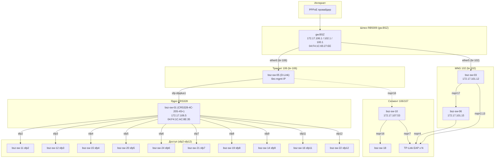

# Топология сети

> Дата обновления: 2026-09-09 (актуализирована по последним данным LLDP+FDB+ARP)
> Источник: LLDP (SNMP lldpRemTable), FDB (dot1qTpFdbTable), ARP (RB5009/CRS328), API RouterOS
> ⚠️ Миграция: ядро — **CRS328 (bsz-sw-01, 172.17.106.5)**; инфраструктура/камеры → 172.17.106/107.x

## Схема (актуальная, Mermaid)

## Линки (подтверждено LLDP/FDB)

| А | Порт А | Порт B | B | Метод |
|---|---|---|---|---|
| **RB5009** (gw.BSZ) | ether6 (br-106) | — | **bsz-sw-05** | LLDP RB5009 (localport 7), FDB RB5009→CRS328 |
| bsz-sw-05 | — | sfp-sfpplus1 | **CRS328** (106.5) | FDB: RB5009 MAC на sfp-sfpplus1; CRS328 MAC на ether6 |
| RB5009 | ether5 (br-102) | порт1 | **bsz-sw-03** (101.12) | LLDP RB5009 (localport 6), LLDP sw-03 |
| bsz-sw-03 | порт17 | порт20 | **bsz-sw-06** (101.15) | LLDP с обеих сторон |
| **CRS328** (106.5) | sfp2 | | bsz-sw-11 | LLDP + FDB |
| CRS328 | sfp3 | | bsz-sw-12 | LLDP |
| CRS328 | sfp4 | | bsz-sw-15 | LLDP |
| CRS328 | sfp5 | | bsz-sw-20 | LLDP |
| CRS328 | sfp6 | | bsz-sw-24 | LLDP |
| CRS328 | sfp7 | | bsz-sw-21 | LLDP |
| CRS328 | sfp8 | | bsz-sw-19 | LLDP |
| CRS328 | sfp9 | | bsz-sw-14 | LLDP |
| CRS328 | sfp11 | | bsz-sw-16 | LLDP |
| CRS328 | sfp12 | | bsz-sw-22 | LLDP |
| **bsz-sw-10** (107.53) | порт16 | | bsz-sw-18 | LLDP |
| bsz-sw-10 | порт7 | | EAP245 | LLDP |

## Адресация (актуальная)

| Устройство | IP | Bridge |
|---|---|---|
| gw.BSZ (RB5009) | 172.17.106.1 / 102.1 / 100.1 / 104.1 | br-106/102/100/104 |
| bsz-sw-01 (CRS328, ядро) | 172.17.106.5 | br-106 (транзит) |
| bsz-sw-05 | без mgmt IP (только L2, транзит) | br-106 |
| bsz-sw-03 | 172.17.101.12 | br-102 |
| bsz-sw-06 | 172.17.101.15 | br-102 |
| bsz-sw-10 | 172.17.107.53 | br-106 |
| bsz-sw-11…24 | за ядром (L2) | br-106 |

## FDB-сводка (reports/fdb/)
- CRS328 (106.5): 181 MAC; **sfp-sfpplus1 = 122 MAC (uplink к RB5009)**, остальные порты sfp2-12 → до 10 MAC
- bsz-sw-10 (107.53): 208 MAC; порт 16 = 201 MAC (uplink)
- bsz-sw-03 (101.12): 36 MAC
- bsz-sw-06 (101.15): 33 MAC

## Ключевые выводы (2026-09-09)
1. **Ядро сети — CRS328 (bsz-sw-01, 106.5)**, аплинк к шлюзу через **sfp-sfpplus1 → bsz-sw-05 → RB5009 ether6**.
2. **bsz-sw-05** — транзитный коммутатор (без управляемого IP) между шлюзом и ядром.
3. **Кластер MNG** (bsz-sw-03/06) подключён к RB5009 ether5 (br-102), отдельно от ядра.
4. **bsz-sw-10** (107.53) — в сегменте 106, uplink порт 16, к CRS328 напрямую НЕ подключён (видит RB5009 через транзит).
5. Сегмент 107.x — Wi-Fi (TP-Link EAP225/223/245).

## Открытые вопросы
- combo3 CRS328 (2 MAC: 04:42:1a:e9:c7:a5, 04:f4:1c:ac:8e:37) — неизвестное устройство MikroTik.
- Полный аплинк bsz-sw-10 (к bsz-sw-05 или bsz-sw-03) не подтверждён.
- Коммутаторы 11-24 за ядром без доступных IP.
