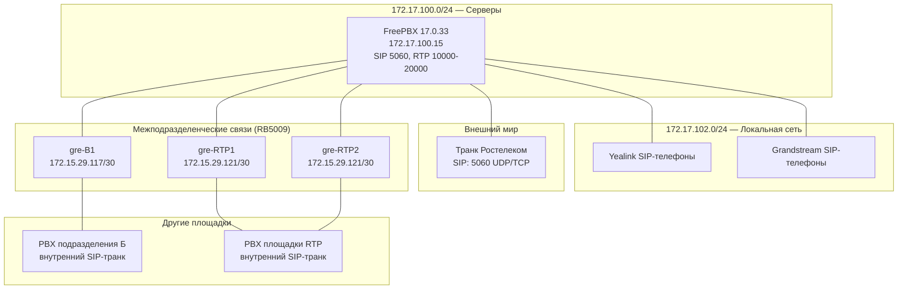

# VoIP — IP-телефония (проект)

> Дата: 2026-09-02
> IP-PBX: **FreePBX 17.0.33** (Asterisk) на **172.17.100.15** (LXC 102, PVE mpve-10)
> Телефоны: **Yealink**, **Grandstream**
> Внешний транк: **Ростелеком** (SIP)
> Межподразделенческие транки: **GRE-туннели** (RB5009)

## Архитектура



## Компоненты

### FreePBX (172.17.100.15)

| Параметр | Значение |
|----------|----------|
| Веб-интерфейс | http://172.17.100.15/admin |
| SIP-порт | 5060 (UDP/TCP) |
| RTP-порт | 10000-20000 (UDP) |
| Версия | FreePBX 17.0.33 / Asterisk |
| Доступ | admin (креды в Vault `bsz/freepbx/admin`) |
| LXC | CTID 102 (PVE mpve-10) |

### SIP-порты (открыть на firewall)

| Протокол | Порт | Назначение |
|----------|------|------------|
| UDP 5060 | SIP | регистрация и сигнализация |
| TCP 5060 | SIP | регистрация (опционально) |
| UDP 10000-20000 | RTP | передача голоса |
| UDP 5060 | Ростелеком | внешний транк |
| UDP 5060 | GRE-сети | внутренние транки |

## Внешний транк — Ростелеком (план)

> ⏳ Настраивается позже (по получении параметров транка).

| Параметр | Значение |
|----------|----------|
| Тип | SIP Trunk |
| Протокол | SIP (UDP) |
| Хост/домен | *(указать после получения)* |
| Логин/пароль | *(в Vault: `bsz/freepbx/trunk_rostelecom`)* |
| Номера | *(диапазон городских номеров)* |

### Порядок настройки (когда будут параметры)
1. **Connectivity → Trunks → Add SIP Trunk**
2. Транк: host = Ростелеком, username = логин, secret = пароль (из Vault)
3. Context: `from-trunk`
4. Outbound Routes: маршрутизация городских звонков через этот транк
5. Inbound Routes: DID-номера → внутренние расширения
6. Проверка: `asterisk -r` → `sip show peers`

## Межподразделенческие транки (GRE-туннели) — методика

> ⏳ Связи настраиваются позже. Туннели GRE уже созданы на RB5009.

### Существующие туннели на RB5009 (из API)

| Туннель | Адрес (локальный) | Статус |
|---------|-------------------|--------|
| gre-B1 | 172.15.29.117/30 | running |
| gre-RTP1 | 172.15.29.121/30 | stopped |
| gre-RTP2 | 172.15.29.121/30 | stopped |

### Схема транков между PBX

Для каждой площадки создаётся **внутренний SIP-транк** между PBX:

1. **На обоих PBX** создать SIP-транк типа `peer`:
   - Хост: адрес удалённого PBX в GRE-сети (172.15.29.x)
   - Username/secret: согласованные (в Vault `bsz/freepbx/trunk_<site>`)
   - Context: `from-trunk`
   - Disallow=all, Allow=ulaw,alaw
2. **На обоих PBX** создать Outbound Route на номерной план удалённой площадки
3. **На обоих PBX** создать Inbound Route с DID-префиксом площадки
4. **Firewall:** разрешить SIP 5060 + RTP 10000-20000 только с адресов GRE-сетей

### Номерной план (рекомендация)

| Диапазон | Назначение |
|----------|-----------|
| 1xx | внутренние расширения основной площадки |
| 8xx | городской номер Ростелекома |
| 2xx | расширения подразделения Б (через gre-B1) |
| 3xx | расширения площадки RTP (через gre-RTP1/2) |

> Номерной план уточняется при подключении связей.

## Автопровижининг телефонов (Yealink, Grandstream)

### Принцип

FreePBX раздаёт телефонам конфигурацию через HTTP:
- **Yealink:** RPS (Redirection Provisioning Server) / HTTP-шаблоны, MAC-адрес телефона
- **Grandstream:** HTTP-провижининг по MAC, файл `cfg<MAC>.xml`

### FreePBX (модуль Endpoint Manager)

1. Установить модуль **Endpoint Manager** (Admin → Modules)
2. Создать шаблон для моделей Yealink/Grandstream
3. Привязать расширение к MAC телефона
4. Телефон получит конфиг при первом включении (по MAC)

### Параметры provisioning

| Параметр | Значение |
|----------|----------|
| HTTP-сервер | http://172.17.100.15 (Apache FreePBX) |
| Путь Yealink | `http://172.17.100.15/pbx?mac=$MAC` (RPS) |
| Путь Grandstream | `http://172.17.100.15/Grandstream/cfg$MAC.xml` |
| Автозапрос | включён (телефон сам запрашивает конфиг) |

### Подготовка телефонов

- Настроить телефону URL provisioning (через меню телефона или DHCP-опции 66)
- Опция DHCP 66 (TFTP-сервер) → 172.17.100.15
- Либо статически указать URL конфигурации

## Настройка FreePBX (базовая, выполняется)

> Пошаговая инструкция через веб-интерфейс: [reports/freepbx-setup-guide.md](reports/freepbx-setup-guide.md)

### 1. Обновить настройки SIP (Asterisk)

```
sip.conf: udpbindaddr=0.0.0.0:5060
rtp.conf: rtpstart=10000, rtpend=20000
```

### 2. Создать расширения

- **Yealink:** диапазон 10x
- **Grandstream:** диапазон 11x

### 3. Настроить firewall

- Разрешить UDP 5060, UDP 10000-20000 на FreePBX (172.17.100.15)
- Доступ к веб /admin — ограничить (FreePBX Firewall)

## Статус настройки

| Задача | Статус |
|--------|--------|
| FreePBX установлен (LXC 102) | ✅ |
| IP FreePBX → 172.17.100.15 | ✅ |
| Веб-доступ admin | ✅ |
| Базовая настройка SIP/RTP/firewall | ⏳ |
| Автопровижининг Yealink/Grandstream | ⏳ |
| Расширения | ⏳ |
| Транк Ростелеком | ⏳ (позже) |
| GRE-транки между площадками | ⏳ (позже) |

## Секреты (Vault `bsz/freepbx/`)

| Путь | Содержимое |
|------|-----------|
| `bsz/freepbx/admin` | веб-админ FreePBX (admin) |
| `bsz/freepbx/trunk_rostelecom` | транк Ростелеком (при получении) |
| `bsz/freepbx/trunk_<site>` | внутренние транки (при настройке) |
| `bsz/freepbx/provisioning` | ключи автопровижининга (при настройке) |
---

## FreePBX 17 — развёртывание и настройка (2026-09-11)

### Размещение
| Параметр | Значение |
|----------|----------|
| Платформа | LXC **VMID 103** на PVE **mpve-10** (172.17.102.10) |
| IP | **172.17.103.228** (DHCP br-102) |
| Веб-интерфейс | http://172.17.103.228/ (admin) |
| Asterisk | 22.10.1 |
| FreePBX | 17.0.33 (framework) |
| Установка | community-scripts `ct/freepbx.sh` (зеркало ghfast.top) |

### Внутренние номера (extensions)
- **Диапазон: 2020–2050** (31 номер), контекст `from-internal`
- Пароль SIP: `FPbx<номер>!` (например, 2020 → `FPbx2020!`)
- Технология: **PJSIP**, порт **5060** UDP
- Созданы через API FreePBX (`Core::addUser` + `addDevice`, tech=pjsip)
- Для автоподключения Yealink: на телефоне указать сервер 172.17.103.228, логин/пароль номера

### Доступ (все секреты — в Vault `bsz/freepbx`)
| Интерфейс | Адрес | Логин |
|-----------|-------|-------|
| Web UI | http://172.17.103.228 | admin / (Vault) |
| AMI | 172.17.103.228:5038 | (Vault: ami_user/ami_password) |
| MySQL | localhost | freepbxuser / (Vault) |
| SNMP | 172.17.103.228:161 | community BSZ-m0n1t0r |
| LLDP | eth0 | видит gw.BSZ (ether3/br-102) |

### Мониторинг
- **SNMP** (snmpd): community `BSZ-m0n1t0r`, порт 161 — готов для Zabbix
- **LLDP** (lldpd): включён, сосед gw.BSZ
- **AMI**: открыт на 0.0.0.0:5038 (permit 172.17.0.0/16) — для мониторинга

### Особенности (важно)
1. **ionCube**: после установки требуется `systemctl restart apache2` (иначе ошибка в веб).
2. **Активация Sangoma**: отключены все коммерческие модули (adv_recovery, areminder, cdrpro,
   pms, sysadmin и др.) — они требовали активацию через недоступный portal. Для локальной АТС не нужны.
3. **Права admin**: пользователь создан вручную в БД, требуется `sections='*'` (иначе
   «ajaxRequest declined — Permissions»).
4. **Мастер Firewall** можно пропустить (Abort) — для локальной АТС не обязателен.
5. **Проблема сети**: deb.freepbx.org (CloudFront) нестабилен — часть IP таймаутит.
   Решение: закрепить рабочий IP в `/etc/hosts` контейнера (`65.9.46.122 deb.freepbx.org`).
6. Установка FreePBX шла ~2 часа, падала на `asterisk22-dahdi` из-за таймаута CloudFront;
   решено предзагрузкой .deb в apt-кэш + закреплением IP.

### Следующие шаги
- [ ] SIP-транк Ростелеком (внешние звонки)
- [ ] GRE-транки между подразделениями (gre-B1, gre-RTP1, gre-RTP2)
- [ ] Автопровижининг Yealink/Grandstream
- [ ] Добавить FreePBX в Zabbix (SNMP) и NetBox

### Firewall FreePBX (2026-09-11, настроен на доверенную сеть)

- **Включён** с доверенной сетью **172.17.0.0/16** (Trusted zone) + рабочие станции
- fail2ban `ignoreip`: `127.0.0.1/8 ::1 172.17.0.0/16` — локальные адреса не банятся
- Cron-задачи авто-перезапуска firewall (каждые 5/15 мин) удалены (`Firewall::removeCronJob`)
- **Fix `.htaccess`**: включён `AllowOverride All` + модуль **mod_rewrite** (иначе 500
  «Invalid command 'RewriteEngine'»)
- Управление: `fwconsole firewall start|stop|add trusted <net>`

### Firewall FreePBX — доверенные сети (обновлено)
- Trusted: **172.17.0.0/16**, **172.15.0.0/16** (VPN/GRE-туннели), 172.17.102.0/23, 172.17.103.0/24, 172.17.103.149/32
- fail2ban ignoreip: `127.0.0.1/8 ::1 172.17.0.0/16 172.15.0.0/16`
- 172.15.0.0/16 — GRE-туннели между подразделениями (gre-B1/RTP1/OP1/ves-BSZ)
